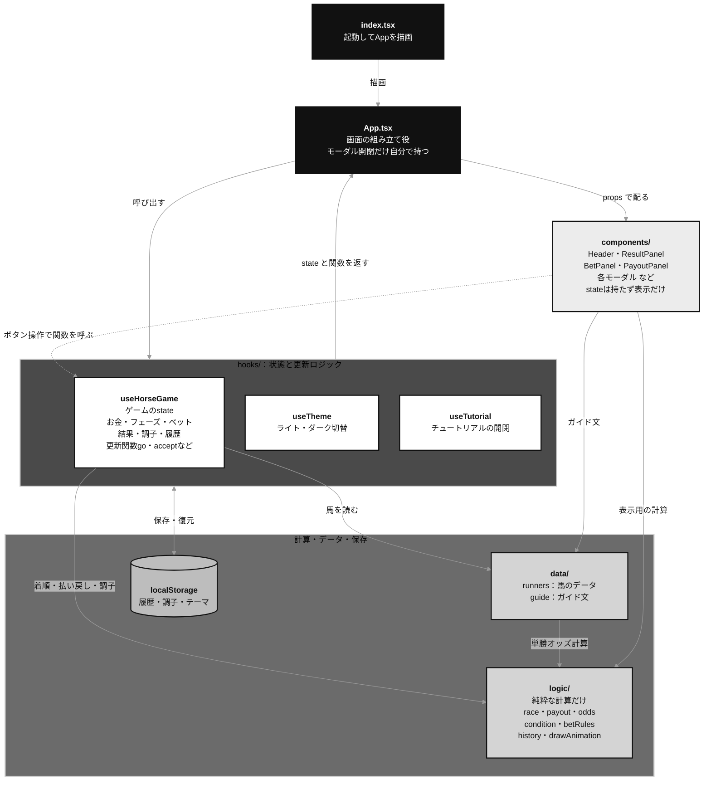

## はじめに

実際に画面が立ち上がるまでのコードがどこなのかをまとめる

## 1. `index.html`

コードの中身は次

```
<!doctype html>
<html lang="ja">
  <head>
    ....
    <title>horsegame</title>
    <script type="module" src="/src/index.tsx"></script>
  </head>

  <body>
    <noscript>JavaScriptを有効にしてください</noscript>
    <div id="root"></div>
  </body>
</html>
```

- `<script>` で使用する `index.tsx` の位置が示されている
- その後の body の `<div id="root"></div>` で、実際に画面が構成されることとなる

## 2. `index.tsx`

コードの中身は次

```
import React from "react";
import ReactDOM from "react-dom/client";
import "./index.css";
import App from "./App";

const root = ReactDOM.createRoot(
  document.getElementById("root") as HTMLElement,
);

root.render(
  <React.StrictMode>
    <App />
  </React.StrictMode>
);
```

- 最初に、 `import "./index.css"` で、 CSS をimportしている
- 前半部分では、 `index.html` から `#root` を探し出してきて、そこを React の描画先と指定している
- 後半部分では、 `<App />` 以下で実際に画面を構成する

## 3. `App.tsx` と全体の構成

`<App />` 以降は、役割ごとに次のように分かれている



- `App` が起点になり、 `hooks` を呼び出して、得られた state を `components` に配る
- **state は `hooks` が持つ**。ゲームの進行に関わるものは `useHorseGame` に集まっている (実際には、呼び出した `App` の state として React に管理される)
- **`logic` は state を持たない、純粋な計算だけ**を行う。 `hooks` からも `components` からも呼ばれる
- **`components` は、 state を直接変えない**。 `App` から渡された関数を呼ぶだけで、実際の更新は `useHorseGame` が行う
- 流れは「`hooks` → `App` → `components`」の一方向で、ボタン操作などは破線の向きで `useHorseGame` に戻る
